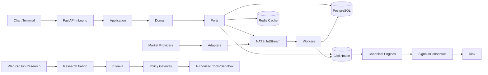

# گراف معماری و جریان داده

## گراف وابستگی معنایی
`Provider → Observation → Normalization → Instrument/Series → Structure → Feature → Signal → Evidence/Consensus → Risk → Presentation`

`Source → Provenance → Dataset Revision → PIT → Replay → Outcome → Calibration → Model Governance`

## گراف agent
`Intent → Policy → Tool Authorization → Action → Evidence → Verification → Health → Rollback/Escalation`

هیچ مسیر مستقیمی از UI یا agent به persistence حساس بدون application/policy boundary مجاز نیست.
